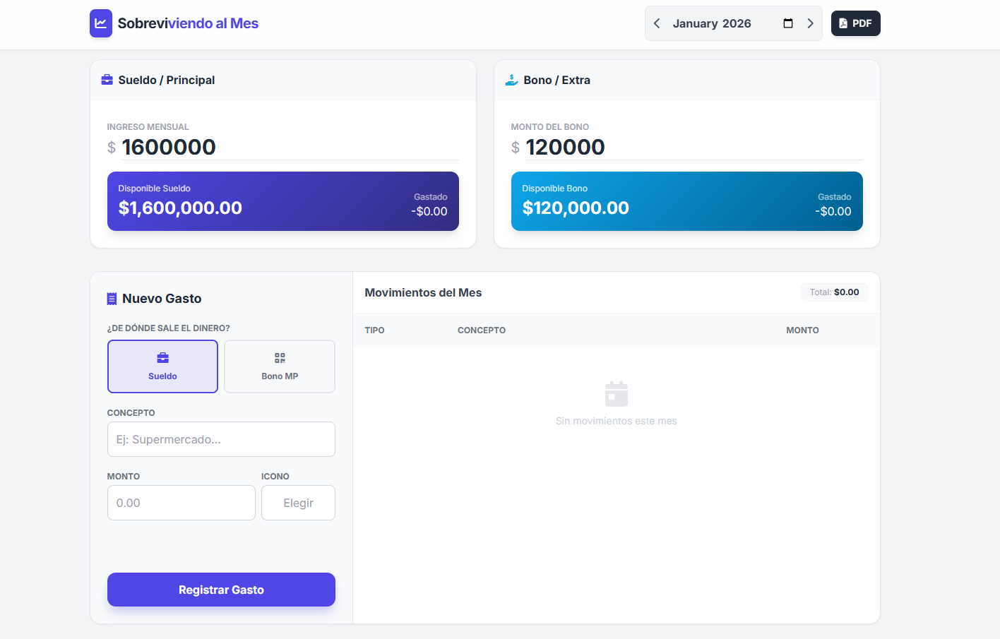

# 💸 Sobreviviendo al Mes

Un dashboard financiero personal, simple y directo para llevar el control de tus ingresos y gastos mensuales sin complicaciones. Olvídate de excels aburridos; esto es visual, rápido y funciona en tu navegador.

(Reemplaza esto con una captura de tu dashboard)

✨ Características Principales

Control Doble: Gestiona dos fuentes de dinero por separado (ej. Sueldo Principal y Bonos/Extras).

Cálculos en Tiempo Real: Ingresa tus montos y mira cómo se actualiza tu "Disponible" automáticamente.

Formateo Inteligente: Los campos de dinero entienden automáticamente miles y decimales para evitar confusiones (ej. 15000 se convierte en 15,000.00).

Exportación a PDF: Genera un reporte profesional en PDF con un solo clic, listo para guardar o imprimir.

Persistencia: Todo se guarda automáticamente en tu navegador (Local Storage). Si cierras la pestaña y vuelves, tus datos siguen ahí.

Privacidad Total: Los datos viven en tu dispositivo, no se envían a ninguna nube externa.

🚀 Cómo Usar

Abrir: Simplemente abre el archivo index.html en cualquier navegador web moderno (Chrome, Edge, Firefox, Safari).

Ingresar Ingresos: Escribe tu sueldo neto y bonos en las tarjetas superiores.

Registrar Gastos:

Selecciona de dónde sale el dinero (Sueldo o Bono).

Escribe qué compraste y cuánto costó.

Elige un icono divertido.

¡Dale a "Registrar"!

Gestionar Meses: Usa las flechas < > en la parte superior para cambiar de mes. Cada mes tiene su propio historial independiente.

🎨 Personalización (¡Hazlo tuyo!)

Puedes cambiar los colores para que coincidan con tu estilo (o tu imagen favorita) editando las variables CSS al principio del archivo index.html.

Busca esta sección en el código:

:root {
    /* Edita estos códigos HEX */
    --color-primary: #4F46E5;   /* Color para Sueldo / Botones Principales */
    --color-secondary: #0EA5E9; /* Color para Bono / Acentos */
    
    --color-bg: #f3f4f6;        /* Color de Fondo de la página */
    --text-dark: #1f2937;
}

Simplemente reemplaza los códigos (ej. #4F46E5) por los colores que tú quieras. Todo el diseño (botones, gradientes, textos) se actualizará automáticamente.

🛠️ Tecnologías Usadas

HTML5 & CSS3

Tailwind CSS (vía CDN) para estilos rápidos y modernos.

JavaScript (Vanilla) para toda la lógica.

FontAwesome para los iconos.

html2pdf.js para la generación de reportes.

Google Fonts (Tipografía 'Inter').
