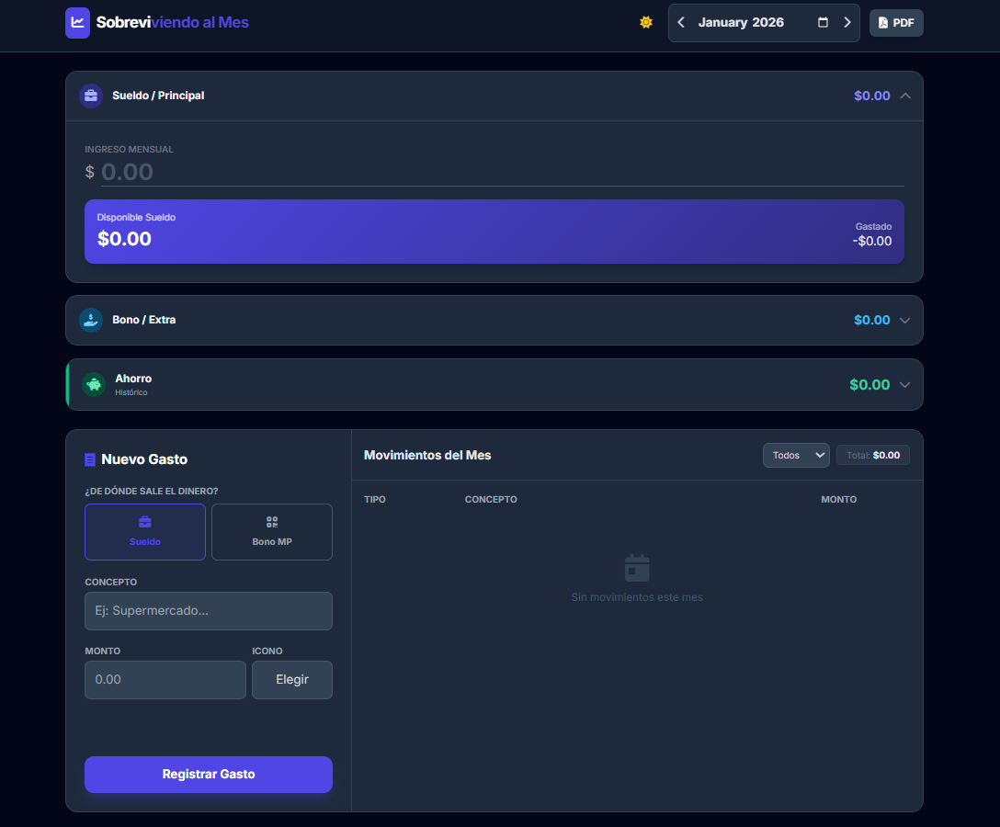

# 💸 Sobreviviendo al Mes

**Dashboard financiero personal** para controlar ingresos, gastos y ahorros mensuales de forma **simple, visual y sin complicaciones**.  
Olvídate de los excels eternos: esto es **rápido, responsivo, moderno y directo en tu navegador**.

---

## 🚀 Deploy

👉 https://sobreviviendo-al-mes.vercel.app/



---

## ✨ Características principales

- ✔️ **Control doble de ingresos**  
  Administra dos fuentes de dinero por separado  
  (por ejemplo: *Sueldo* + *Bonos/Extras*).

- 🌙 **Modo oscuro automático y manual**  
  Detecta la preferencia del sistema e incluye interruptor.

- 💰 **Gestión de ahorros**
  - cálculo automático del ahorro mensual  
  - histórico acumulado (“tu imperio”)

- 🧠 **Control inteligente de gastos**
  - alerta de **gastos hormiga** 🐜 al superar $100.000  
  - popup + alerta visual

- 🔍 **Filtros por categoría**
  - supermercado, casa, servicios, etc.

- ✏️ **Edición completa de movimientos**
  Puedes editar:
  - monto  
  - concepto  
  - ícono  
  - origen del dinero  

- 📱 **Diseño responsivo**
  - pensado para móviles  
  - tarjetas con acordeones

- 🔢 **Formato automático de montos**
  Comas y decimales para evitar errores de lectura.

- 📄 **Exportación a PDF**
  Incluye:
  - resumen de saldos  
  - total gastado  
  - detalle de movimientos  

- 🔒 **Privacidad total**
  Todo se guarda en **LocalStorage**.  
  Nada sale de tu dispositivo.

---

## 🧭 Cómo usar

1. **Abrir**
   - abre `index.html` en tu navegador

2. **Configurar ingresos**
   - completa “Sueldo” y “Bono”

3. **Registrar gastos**
   - elige el origen (Sueldo / Bono)
   - agrega concepto, monto e ícono

4. **Analizar**
   - usa el filtro de categorías
   - mira la tarjeta de ahorro

5. **Gestionar**
   - ✏️ editar registros  
   - 🗑️ eliminar registros  
   - ⬅️➡️ cambiar de mes  

Todo se actualiza en **tiempo real**.

---

## 🎨 Personalización

Puedes modificar la paleta de colores editando las variables CSS en `index.html`:

```css
:root {
  --color-primary: #4F46E5;   /* Color principal */
  --color-secondary: #0EA5E9; /* Color secundario */
  --color-tertiary: #10B981;  /* Color de ahorro */
  --color-bg: #f3f4f6;        /* Fondo modo claro */
}
```

---

## 🛠️ Tecnologías utilizadas

- HTML5 + CSS3  
- Tailwind CSS (CDN)  
- JavaScript Vanilla  
- LocalStorage  
- FontAwesome (iconos)  
- html2pdf.js  
- Google Fonts — *Inter*

---

## 💡 Próximas mejoras (roadmap)

- gráficos de gastos por categoría  
- más fuentes de ingresos configurables  
- backup en la nube opcional  
- multimoneda  

---

### ✨ Autor

Proyecto desarrollado con 💚 para organizar mejor las finanzas personales.
